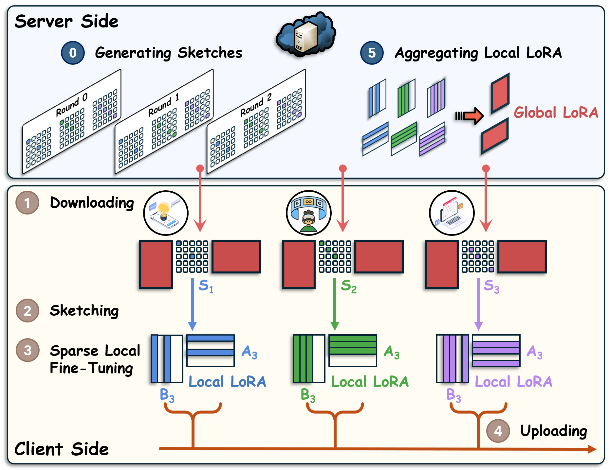

## Federated Sketching LoRA: On-Device Collaborative Fine-Tuning of Large Language Models

[](https://www.python.org/downloads/release/python-31012/)
[](https://opensource.org/licenses/MIT) 

---
## 🔥 Our Framework

TL, DR: In this repo, we provide the implementation of **Federated Sketching LoRA** (FSLoRA), a sketching-based methodology for collaborative LLM fine-tuning across resource-heterogeneous devices

<div align="center">
    
</div>


## 🖥️ Prerequisites

Install the required packages via:
```bash
pip install -r requirements.txt
```

Alternatively, ensure the following dependencies are installed:
```plaintext
python == 3.10.14
torch == 2.6.0
transformers == 4.50.1
peft == 0.14.0
accelerate == 1.2.1
bitsandbytes == 0.45.3
datasets == 3.2.0
vllm == 0.8.2
```

## 🗂️ Folder Structure
```
FSLoRA/
│   README.md
│   requirements.txt
├─── src/
│   │   arg.py
│   │   LoRA_Sketching.py
│   │   evaluation_vllm.py
│   │   models.py
│   │   utils_data.py
│   │   main.py
│   │   run_main.sh
```
- **`src/`**: Contains the primary codebase.
  - `LoRA_Sketching.py`: Our FSLoRA framework.
  - `models.py`: Building model and adapters.
  - `evaluation_vllm.py`: For fast evaluation.
  - `run_main.sh`: Execute FSLoRA algorithm and evaluate the checkpoints

## Dataset
For the commonsense reasoning benchmark, data is downloaded from [Commonsense Reasoning Benchmark Dataset](https://github.com/AGI-Edgerunners/LLM-Adapters/tree/main/dataset)

## 🏃‍♂ Run Code

Run our framework with the following command:
```bash
./run_main.sh
```
This code runs with 4 NVIDIA A100 GPUs in parallel, using the Accelerate library for efficient multi-GPU support.
